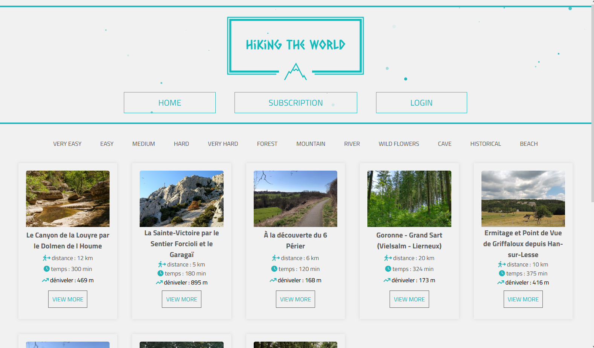
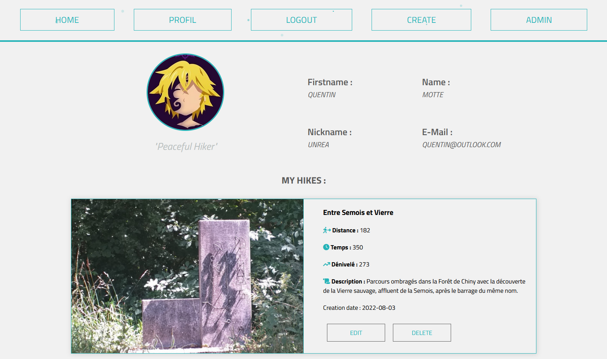
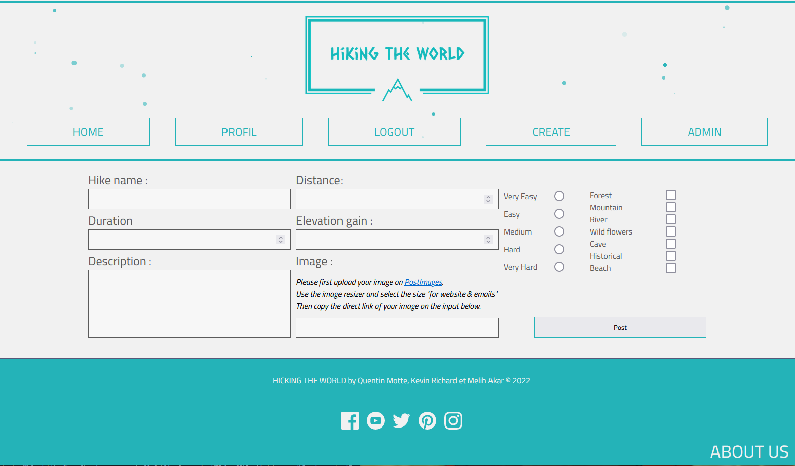
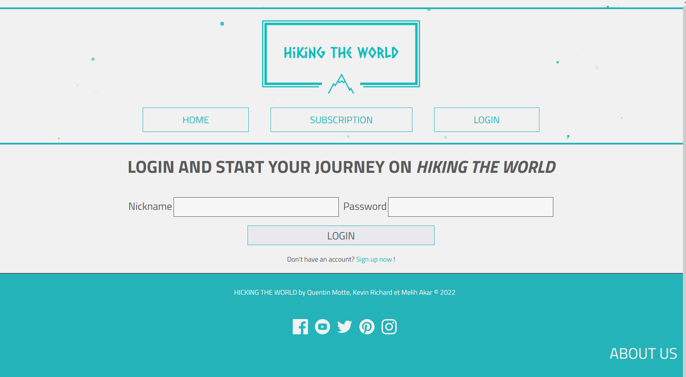
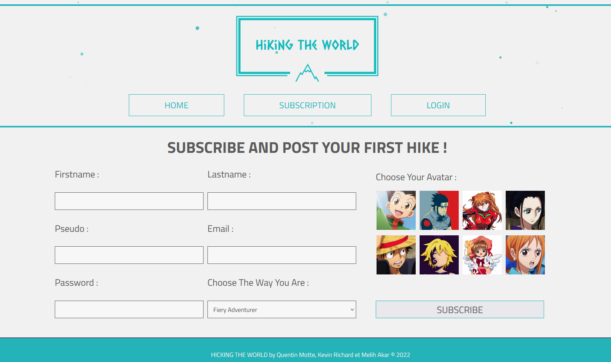
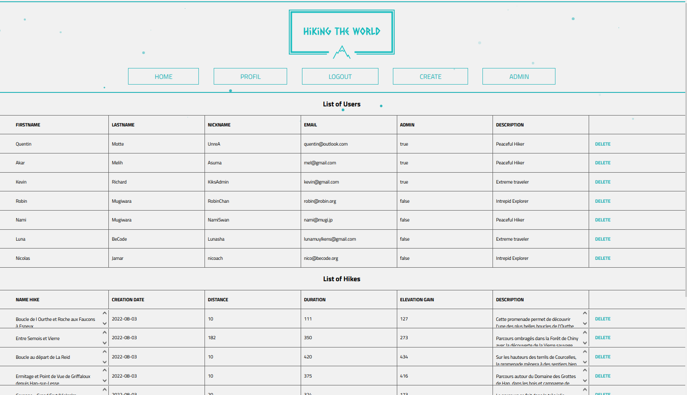

#  Hiking Project

@Becode  

In this exercise we have to realize a web site for hiking with php, mysql. The design is free. We need to deploy our site on Heroku.

 

## &#128101; Group

_No one can whistle a symphony. It takes a whole orchestra to play it._ - H.E. Luccock

 | | Quentin | |

 | | Kevin | |

 | | Melih | |

  

[Our Web site](https://phpgang.herokuapp.com/)  

 

## Method

- Documentation on PHP/MYSQL
- Trello
- Team organization
- Folders organization
- Work dispatching

 

## 🛠️ The tools we used

### **Languages :**  

-   PHP 
-   JS 
-   SASS 
-   MYSQL

### **Software and programs :**  

-   VScode 
-   Live Share 
-   Live Sass 
-   GitHub 
-   GitBash

 

## What we can improve for our projects

-   Add subscripiton mails/newsletter
-   A system with like and unlike
-   Add comment
-   More security for our inputs and link
-   A better router
-   Make a better OOP/MVC

 

## Instructions

&#9745; Creation of the database.

&#9745; Architecture MVC/OOP.

&#9745; Design free.

&#9745; Layout 

- &#9745; The list of hikes

- &#9745; A single hike

- &#9745; The list of hikes per tag

- &#9745; Subscription page

- &#9745; User profile  

The website should contain all the basics interactions for making the life of users easy.

## Features  

- &#9745; Add hike
- &#9745; Edit a hike
- &#9745; Delete a hike
- &#9745; Admin account
- &#9745; User profile
- &#9745; Update profile
- &#9745; "panel" admin
- &#9745; Responsive

 

### For GitHub

&#9745; Write a good README

&#9745; Mention a description and the website URL on the top of the repository

 

### Bonus

&#9745; Design

&#9745; Title & Motto

&#9745; Deployement

 
  
### Some preview of our web site 
 
  
  
  
  

